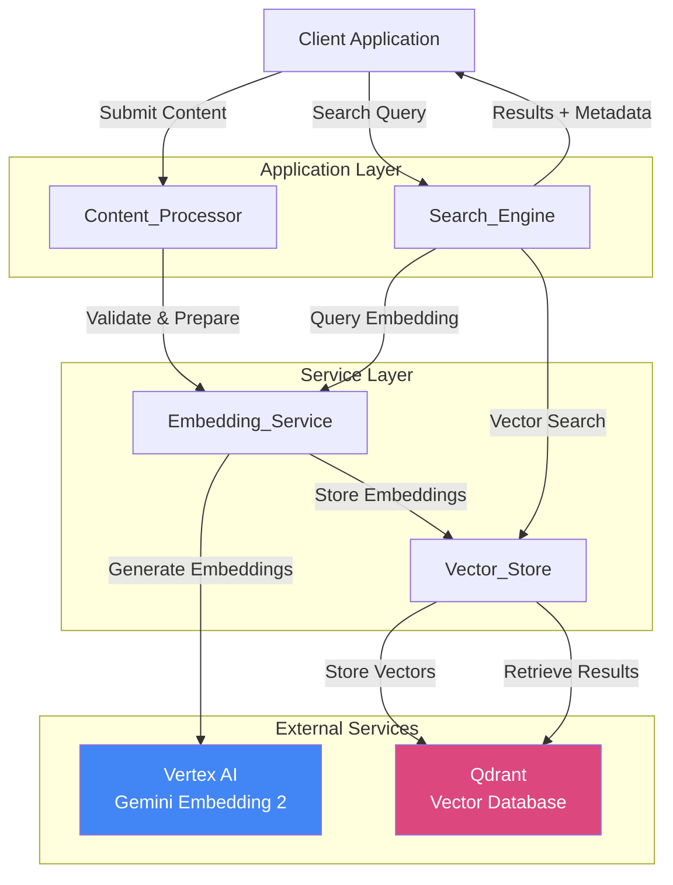
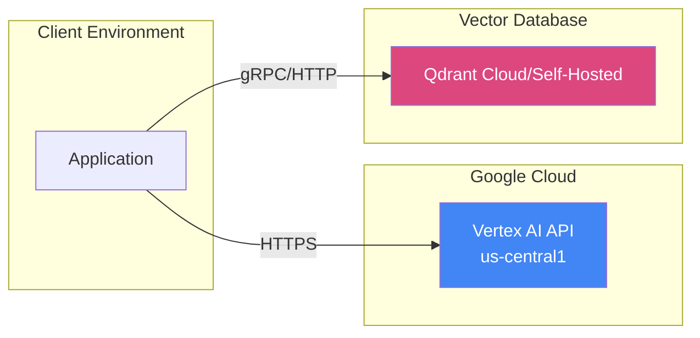
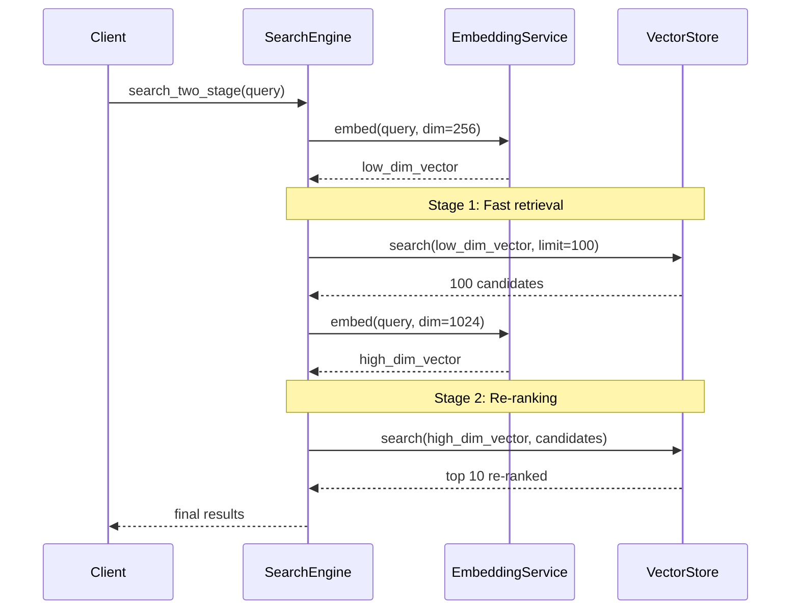
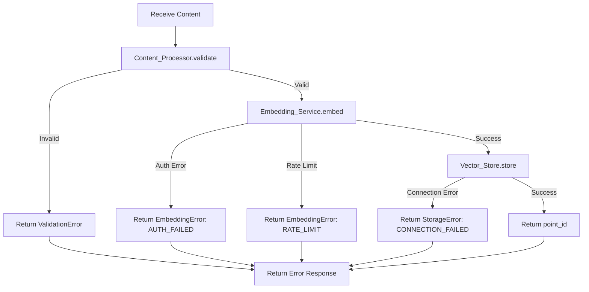
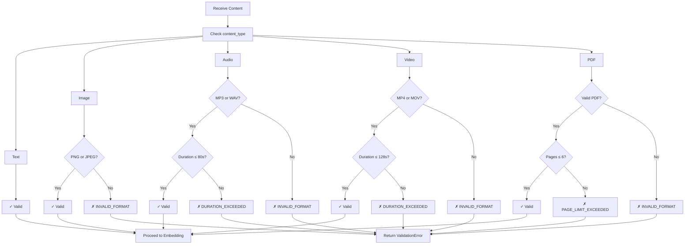

# Design Document: Multimodal Search with Vertex AI and Qdrant

## Overview

This design document specifies the architecture and implementation details for a multimodal semantic search system that leverages Vertex AI's Gemini Embedding 2 model and Qdrant vector database. The system enables cross-modal search capabilities where queries in one modality (text, image, audio, video, or PDF) can retrieve semantically relevant content from any other modality.

### Key Design Principles

1. **Native Multimodal Processing**: Gemini Embedding 2 processes each modality directly without conversion, preserving the semantic richness of each content type
2. **Unified Vector Space**: All modalities are mapped to a shared semantic space, enabling true cross-modal search
3. **Flexible Dimensionality**: Matryoshka embeddings support dimensions from 128 to 3072, allowing performance-quality tradeoffs
4. **Two-Stage Retrieval**: Optimize search by using lower dimensions for initial retrieval and higher dimensions for re-ranking
5. **Multilingual Support**: Native support for 100+ languages with cross-lingual semantic understanding

### System Capabilities

- Embed text, images (PNG/JPEG), audio (MP3/WAV), video (MP4/MOV), and PDF documents
- Store embeddings with rich metadata in Qdrant vector database
- Perform cross-modal semantic search (e.g., text query retrieves images)
- Filter results by modality, timestamp, or custom metadata
- Support batch embedding for efficient processing
- Two-stage retrieval for speed-accuracy optimization
- Multilingual and cross-lingual search capabilities

## Architecture

### High-Level Architecture



### Component Interaction Flow

**Embedding Flow:**
1. Client submits content to Content_Processor
2. Content_Processor validates format, size, and constraints
3. Content_Processor forwards validated content to Embedding_Service
4. Embedding_Service calls Vertex AI Gemini Embedding 2 API
5. Embedding_Service receives embedding vectors
6. Embedding_Service stores vectors in Vector_Store (Qdrant)
7. Vector_Store returns unique identifier to client

**Search Flow:**
1. Client submits query (any modality) to Search_Engine
2. Search_Engine validates query and extracts parameters
3. Search_Engine calls Embedding_Service to embed query
4. Search_Engine performs vector search via Vector_Store
5. For two-stage retrieval: initial search with lower dimension, re-rank with higher dimension
6. Vector_Store retrieves matching vectors with metadata
7. Search_Engine ranks and formats results
8. Search_Engine returns results with similarity scores and metadata

### Deployment Architecture




## Components and Interfaces

### Content_Processor

**Responsibility**: Validates and prepares content for embedding, ensuring all constraints are met before API calls.

**Interface:**

```python
class ContentProcessor:
    def validate_text(self, text: str) -> ValidationResult:
        """Validates text content for embedding."""
        pass
    
    def validate_image(self, image_data: bytes, mime_type: str) -> ValidationResult:
        """Validates image format (PNG/JPEG) and size."""
        pass
    
    def validate_audio(self, audio_data: bytes, mime_type: str) -> ValidationResult:
        """Validates audio format (MP3/WAV) and duration (<= 80s)."""
        pass
    
    def validate_video(self, video_data: bytes, mime_type: str) -> ValidationResult:
        """Validates video format (MP4/MOV) and duration (<= 128s)."""
        pass
    
    def validate_pdf(self, pdf_data: bytes) -> ValidationResult:
        """Validates PDF format and page count (<= 6 pages)."""
        pass
    
    def validate_batch(self, content_items: List[ContentItem]) -> BatchValidationResult:
        """Validates all items in a batch before processing."""
        pass
    
    def prepare_for_embedding(self, content: ContentItem) -> PreparedContent:
        """Prepares validated content for Vertex AI API call."""
        pass
```

**Validation Rules:**
- Text: No specific size limit, multilingual support
- Images: PNG or JPEG only, max 6 images per batch
- Audio: MP3 or WAV only, max 80 seconds duration
- Video: MP4 or MOV only, max 128 seconds duration
- PDF: PDF format only, max 6 pages

**Error Handling:**
- Returns descriptive ValidationResult with error type and message
- Fails fast before making API calls to avoid wasted requests
- Validates MIME types match actual content format


### Embedding_Service

**Responsibility**: Interfaces with Vertex AI Gemini Embedding 2 to generate embeddings for all modalities.

**Interface:**

```python
class EmbeddingService:
    def __init__(self, project_id: str, location: str = "us-central1"):
        """Initialize with GCP project and location."""
        self.project_id = project_id
        self.location = location
        self.model = "gemini-embedding-2-preview"
    
    def embed_text(
        self, 
        text: str, 
        dimension: int = 756
    ) -> EmbeddingResult:
        """Generate embedding for text content."""
        pass
    
    def embed_image(
        self, 
        image_data: bytes, 
        dimension: int = 756
    ) -> EmbeddingResult:
        """Generate embedding for image content."""
        pass
    
    def embed_audio(
        self, 
        audio_data: bytes, 
        dimension: int = 756
    ) -> EmbeddingResult:
        """Generate embedding for audio content."""
        pass
    
    def embed_video(
        self, 
        video_data: bytes, 
        dimension: int = 756
    ) -> EmbeddingResult:
        """Generate embedding for video content."""
        pass
    
    def embed_pdf(
        self, 
        pdf_data: bytes, 
        dimension: int = 756
    ) -> EmbeddingResult:
        """Generate embedding for PDF content."""
        pass
    
    def embed_batch(
        self, 
        content_items: List[ContentItem], 
        dimension: int = 756
    ) -> List[EmbeddingResult]:
        """Generate embeddings for multiple items in single API call."""
        pass
    
    def embed_with_multiple_dimensions(
        self,
        content: ContentItem,
        dimensions: List[int]
    ) -> Dict[int, EmbeddingResult]:
        """Generate embeddings at multiple dimensions for two-stage retrieval."""
        pass
```

**Key Features:**
- Single model ("gemini-embedding-2-preview") handles all modalities
- Matryoshka dimensions: 128, 256, 512, 756, 1024, 1536, 2048, 3072
- Default dimension: 756 (balanced performance/quality)
- Batch processing for efficiency
- All embeddings map to unified vector space

**API Integration:**
- Uses Vertex AI Python SDK
- Authenticates via GCP service account or application default credentials
- Handles rate limiting and retries
- Returns embeddings with metadata (dimension, model version)


### Vector_Store

**Responsibility**: Manages storage and retrieval of embeddings in Qdrant vector database.

**Interface:**

```python
class VectorStore:
    def __init__(self, qdrant_url: str, api_key: Optional[str] = None):
        """Initialize connection to Qdrant."""
        self.client = QdrantClient(url=qdrant_url, api_key=api_key)
        self.collection_name = "multimodal_embeddings"
    
    def initialize_collection(
        self, 
        dimension: int = 756,
        enable_named_vectors: bool = True
    ) -> None:
        """Create collection with appropriate configuration."""
        pass
    
    def store_embedding(
        self,
        vector: List[float],
        metadata: EmbeddingMetadata,
        point_id: Optional[str] = None
    ) -> str:
        """Store single embedding with metadata."""
        pass
    
    def store_embedding_with_named_vectors(
        self,
        vectors: Dict[str, List[float]],  # e.g., {"dim_256": [...], "dim_1024": [...]}
        metadata: EmbeddingMetadata,
        point_id: Optional[str] = None
    ) -> str:
        """Store multiple dimension embeddings for same content."""
        pass
    
    def store_batch(
        self,
        embeddings: List[Tuple[List[float], EmbeddingMetadata]]
    ) -> List[str]:
        """Store multiple embeddings efficiently."""
        pass
    
    def search(
        self,
        query_vector: List[float],
        limit: int = 10,
        filters: Optional[SearchFilters] = None,
        score_threshold: Optional[float] = None
    ) -> List[SearchResult]:
        """Search for similar vectors."""
        pass
    
    def search_with_named_vector(
        self,
        query_vector: List[float],
        vector_name: str,  # e.g., "dim_256"
        limit: int = 10,
        filters: Optional[SearchFilters] = None
    ) -> List[SearchResult]:
        """Search using specific named vector."""
        pass
    
    def get_by_id(self, point_id: str) -> Optional[StoredEmbedding]:
        """Retrieve embedding and metadata by ID."""
        pass
    
    def delete_by_id(self, point_id: str) -> bool:
        """Delete embedding by ID."""
        pass
```

**Qdrant Collection Configuration:**
- Collection name: "multimodal_embeddings"
- Distance metric: Cosine similarity
- Named vectors for two-stage retrieval support
- Indexed metadata fields for efficient filtering

**Named Vectors Strategy:**
For two-stage retrieval, store multiple dimensions:
```python
{
    "dim_256": [256-dimensional vector],
    "dim_1024": [1024-dimensional vector]
}
```


### Search_Engine

**Responsibility**: Orchestrates search operations, including query embedding, vector search, and result ranking.

**Interface:**

```python
class SearchEngine:
    def __init__(
        self, 
        embedding_service: EmbeddingService,
        vector_store: VectorStore
    ):
        """Initialize with required services."""
        self.embedding_service = embedding_service
        self.vector_store = vector_store
    
    def search(
        self,
        query: ContentItem,
        limit: int = 10,
        modality_filter: Optional[List[str]] = None,
        dimension: int = 756,
        score_threshold: Optional[float] = None
    ) -> SearchResponse:
        """Perform single-stage semantic search."""
        pass
    
    def search_two_stage(
        self,
        query: ContentItem,
        first_stage_dimension: int = 256,
        second_stage_dimension: int = 1024,
        first_stage_limit: int = 100,
        final_limit: int = 10,
        modality_filter: Optional[List[str]] = None
    ) -> SearchResponse:
        """Perform two-stage retrieval for speed-accuracy optimization."""
        pass
    
    def search_cross_modal(
        self,
        query: ContentItem,
        target_modalities: List[str],
        limit: int = 10,
        dimension: int = 756
    ) -> SearchResponse:
        """Search across specific modalities."""
        pass
    
    def search_multilingual(
        self,
        query_text: str,
        query_language: str,
        target_languages: Optional[List[str]] = None,
        limit: int = 10
    ) -> SearchResponse:
        """Perform cross-lingual search."""
        pass
```

**Search Strategies:**

1. **Single-Stage Search:**
   - Embed query at specified dimension
   - Search Qdrant with query vector
   - Apply filters (modality, metadata)
   - Return top-k results with scores

2. **Two-Stage Retrieval:**
   - Stage 1: Search with lower dimension (e.g., 256) to get top-N candidates (e.g., 100)
   - Stage 2: Re-rank candidates using higher dimension (e.g., 1024) to get final top-k (e.g., 10)
   - Significantly faster than single-stage high-dimension search
   - Maintains accuracy by using high dimension for final ranking

3. **Cross-Modal Search:**
   - Query in any modality retrieves results from any modality
   - Unified vector space enables semantic matching across modalities
   - Example: Text "sunset over ocean" retrieves relevant images, videos, audio

**Result Ranking:**
- Primary: Cosine similarity score (0-1 range)
- Optional: Apply score threshold to filter low-quality matches
- Return results in descending order of similarity


## Data Models

### ContentItem

Represents content to be embedded or used as a query.

```python
@dataclass
class ContentItem:
    content_type: str  # "text", "image", "audio", "video", "pdf"
    data: Union[str, bytes]  # Text string or binary data
    mime_type: Optional[str] = None  # e.g., "image/jpeg", "audio/mp3"
    source_id: Optional[str] = None  # Original source identifier
    metadata: Optional[Dict[str, Any]] = None  # Custom metadata
```

### EmbeddingMetadata

Metadata stored alongside embeddings in Qdrant.

```python
@dataclass
class EmbeddingMetadata:
    content_type: str  # "text", "image", "audio", "video", "pdf"
    source_id: str  # Unique identifier for source content
    timestamp: datetime  # When content was indexed
    dimension: int  # Embedding dimension used
    model_version: str  # e.g., "gemini-embedding-2-preview"
    language: Optional[str] = None  # For text content
    duration: Optional[float] = None  # For audio/video (seconds)
    page_count: Optional[int] = None  # For PDFs
    custom_metadata: Optional[Dict[str, Any]] = None  # User-defined fields
```

### EmbeddingResult

Result from embedding operation.

```python
@dataclass
class EmbeddingResult:
    vector: List[float]  # Embedding vector
    dimension: int  # Vector dimension
    content_type: str  # Modality
    model_version: str  # Model used
    metadata: Optional[Dict[str, Any]] = None
```

### SearchResult

Individual search result with metadata.

```python
@dataclass
class SearchResult:
    point_id: str  # Qdrant point ID
    score: float  # Similarity score (0-1)
    content_type: str  # Modality
    source_id: str  # Original content identifier
    timestamp: datetime  # When indexed
    metadata: EmbeddingMetadata  # Full metadata
    vector: Optional[List[float]] = None  # Include if requested
```

### SearchResponse

Complete search response.

```python
@dataclass
class SearchResponse:
    results: List[SearchResult]  # Ranked results
    query_metadata: Dict[str, Any]  # Query information
    total_results: int  # Number of results returned
    search_time_ms: float  # Search duration
    two_stage: bool = False  # Whether two-stage retrieval was used
```


### Qdrant Point Structure

Structure of data stored in Qdrant.

**Single Dimension Storage:**
```json
{
  "id": "uuid-or-custom-id",
  "vector": [0.123, -0.456, ...],
  "payload": {
    "content_type": "image",
    "source_id": "img_12345",
    "timestamp": "2024-01-15T10:30:00Z",
    "dimension": 756,
    "model_version": "gemini-embedding-2-preview",
    "mime_type": "image/jpeg",
    "custom_metadata": {
      "tags": ["sunset", "ocean"],
      "author": "user_123"
    }
  }
}
```

**Named Vectors Storage (Two-Stage Retrieval):**
```json
{
  "id": "uuid-or-custom-id",
  "vector": {
    "dim_256": [0.123, -0.456, ...],
    "dim_1024": [0.789, -0.234, ...]
  },
  "payload": {
    "content_type": "text",
    "source_id": "doc_67890",
    "timestamp": "2024-01-15T10:30:00Z",
    "dimensions": [256, 1024],
    "model_version": "gemini-embedding-2-preview",
    "language": "en",
    "custom_metadata": {
      "title": "Machine Learning Guide",
      "category": "education"
    }
  }
}
```

### ValidationResult

Result from content validation.

```python
@dataclass
class ValidationResult:
    valid: bool
    error_type: Optional[str] = None  # e.g., "INVALID_FORMAT", "SIZE_EXCEEDED"
    error_message: Optional[str] = None
    warnings: List[str] = field(default_factory=list)
```

### SearchFilters

Filters for search queries.

```python
@dataclass
class SearchFilters:
    content_types: Optional[List[str]] = None  # Filter by modality
    source_ids: Optional[List[str]] = None  # Filter by specific sources
    timestamp_from: Optional[datetime] = None  # Time range start
    timestamp_to: Optional[datetime] = None  # Time range end
    languages: Optional[List[str]] = None  # Filter by language (text only)
    custom_filters: Optional[Dict[str, Any]] = None  # User-defined filters
```


## API Design

### Embedding API

**Endpoint: Embed Content**

```python
def embed_content(
    content: ContentItem,
    dimension: int = 756,
    store: bool = True,
    named_vectors: Optional[List[int]] = None
) -> EmbeddingResponse:
    """
    Embed content and optionally store in Qdrant.
    
    Args:
        content: Content to embed
        dimension: Embedding dimension (128-3072)
        store: Whether to store in Qdrant
        named_vectors: Additional dimensions for two-stage retrieval
    
    Returns:
        EmbeddingResponse with vector and point_id (if stored)
    
    Raises:
        ValidationError: Content validation failed
        EmbeddingError: Vertex AI API error
        StorageError: Qdrant storage error
    """
```

**Endpoint: Batch Embed**

```python
def embed_batch(
    content_items: List[ContentItem],
    dimension: int = 756,
    store: bool = True
) -> BatchEmbeddingResponse:
    """
    Embed multiple items in single API call.
    
    Args:
        content_items: List of content to embed
        dimension: Embedding dimension
        store: Whether to store in Qdrant
    
    Returns:
        BatchEmbeddingResponse with results for each item
    
    Raises:
        ValidationError: One or more items failed validation
        EmbeddingError: Vertex AI API error
    """
```

### Search API

**Endpoint: Search**

```python
def search(
    query: ContentItem,
    limit: int = 10,
    filters: Optional[SearchFilters] = None,
    dimension: int = 756,
    score_threshold: Optional[float] = None,
    include_vectors: bool = False
) -> SearchResponse:
    """
    Perform semantic search.
    
    Args:
        query: Query content (any modality)
        limit: Maximum results to return
        filters: Search filters (modality, time range, etc.)
        dimension: Embedding dimension for search
        score_threshold: Minimum similarity score
        include_vectors: Include vectors in response
    
    Returns:
        SearchResponse with ranked results
    
    Raises:
        ValidationError: Query validation failed
        SearchError: Search operation failed
    """
```

**Endpoint: Two-Stage Search**

```python
def search_two_stage(
    query: ContentItem,
    first_stage_config: StageConfig,
    second_stage_config: StageConfig,
    filters: Optional[SearchFilters] = None
) -> SearchResponse:
    """
    Perform two-stage retrieval.
    
    Args:
        query: Query content
        first_stage_config: Config for initial retrieval (dimension, limit)
        second_stage_config: Config for re-ranking (dimension, limit)
        filters: Search filters
    
    Returns:
        SearchResponse with re-ranked results
    
    Example:
        first_stage = StageConfig(dimension=256, limit=100)
        second_stage = StageConfig(dimension=1024, limit=10)
    """
```


### Configuration API

**Endpoint: Initialize System**

```python
def initialize_system(
    vertex_ai_config: VertexAIConfig,
    qdrant_config: QdrantConfig,
    default_dimension: int = 756,
    enable_two_stage: bool = True
) -> SystemStatus:
    """
    Initialize the multimodal search system.
    
    Args:
        vertex_ai_config: GCP project, location, credentials
        qdrant_config: Qdrant URL, API key, collection settings
        default_dimension: Default embedding dimension
        enable_two_stage: Enable two-stage retrieval support
    
    Returns:
        SystemStatus with initialization results
    """
```

**Configuration Models:**

```python
@dataclass
class VertexAIConfig:
    project_id: str
    location: str = "us-central1"
    credentials_path: Optional[str] = None
    model: str = "gemini-embedding-2-preview"

@dataclass
class QdrantConfig:
    url: str
    api_key: Optional[str] = None
    collection_name: str = "multimodal_embeddings"
    distance_metric: str = "cosine"
    enable_named_vectors: bool = True

@dataclass
class StageConfig:
    dimension: int
    limit: int
```

## Implementation Details

### Cross-Modal Search Implementation

**Unified Vector Space:**
Gemini Embedding 2 maps all modalities to a shared semantic space, enabling direct comparison between different content types.

```python
def cross_modal_search_flow(query: ContentItem, target_modalities: List[str]):
    # 1. Embed query (any modality)
    query_vector = embedding_service.embed(query)
    
    # 2. Search Qdrant with modality filter
    filters = SearchFilters(content_types=target_modalities)
    results = vector_store.search(
        query_vector=query_vector.vector,
        filters=filters
    )
    
    # 3. Results are semantically similar across modalities
    # Example: Text query "dog playing" retrieves:
    #   - Images of dogs playing
    #   - Videos of dogs
    #   - Audio of dog sounds
    #   - PDFs about dog behavior
    
    return results
```

**Key Implementation Points:**
- No modality conversion required (Gemini processes each natively)
- Single embedding call regardless of query modality
- Qdrant metadata filtering for target modalities
- Cosine similarity works across all modalities


### Two-Stage Retrieval Implementation

**Architecture:**



**Implementation:**

```python
def two_stage_retrieval(
    query: ContentItem,
    first_dim: int = 256,
    second_dim: int = 1024,
    first_limit: int = 100,
    final_limit: int = 10
) -> SearchResponse:
    """
    Two-stage retrieval for speed-accuracy optimization.
    """
    # Stage 1: Fast retrieval with lower dimension
    query_vector_low = embedding_service.embed(query, dimension=first_dim)
    
    candidates = vector_store.search_with_named_vector(
        query_vector=query_vector_low.vector,
        vector_name=f"dim_{first_dim}",
        limit=first_limit
    )
    
    # Stage 2: Re-rank with higher dimension
    query_vector_high = embedding_service.embed(query, dimension=second_dim)
    
    # Extract candidate IDs
    candidate_ids = [c.point_id for c in candidates]
    
    # Re-rank using high dimension vectors
    final_results = vector_store.search_with_named_vector(
        query_vector=query_vector_high.vector,
        vector_name=f"dim_{second_dim}",
        limit=final_limit,
        filters=SearchFilters(point_ids=candidate_ids)
    )
    
    return SearchResponse(
        results=final_results,
        two_stage=True,
        query_metadata={
            "first_stage_dim": first_dim,
            "second_stage_dim": second_dim,
            "candidates_retrieved": len(candidates)
        }
    )
```

**Performance Benefits:**
- Stage 1 searches smaller vectors (256-dim) across entire database → fast
- Stage 2 only re-ranks 100 candidates with larger vectors (1024-dim) → accurate
- Typical speedup: 3-5x compared to single-stage 1024-dim search
- Accuracy: ~95-98% of single-stage high-dimension search

**Storage Requirements:**
For two-stage retrieval, store embeddings at multiple dimensions using Qdrant named vectors:

```python
# When indexing content
vectors = {
    "dim_256": embedding_service.embed(content, dimension=256).vector,
    "dim_1024": embedding_service.embed(content, dimension=1024).vector
}

vector_store.store_embedding_with_named_vectors(
    vectors=vectors,
    metadata=metadata
)
```


### Batch Processing Implementation

**Batch Embedding Flow:**

```python
def batch_embed_and_store(content_items: List[ContentItem]) -> BatchResult:
    """
    Efficiently process multiple items.
    """
    # 1. Validate all items first
    validation_results = content_processor.validate_batch(content_items)
    
    if not all(r.valid for r in validation_results):
        raise ValidationError("Some items failed validation", validation_results)
    
    # 2. Group by modality for optimal API calls
    grouped = group_by_modality(content_items)
    
    # 3. Embed each group (Vertex AI supports mixed modality batches)
    all_embeddings = []
    for modality, items in grouped.items():
        embeddings = embedding_service.embed_batch(items)
        all_embeddings.extend(embeddings)
    
    # 4. Batch store in Qdrant
    point_ids = vector_store.store_batch(all_embeddings)
    
    return BatchResult(
        success_count=len(point_ids),
        point_ids=point_ids
    )
```

**Batch Size Limits:**
- Images: Max 6 per batch (Vertex AI limit)
- Other modalities: No strict limit, but recommend batches of 10-50 for optimal performance
- Mixed modality batches: Supported by Gemini Embedding 2

### Multilingual Implementation

**Cross-Lingual Search:**

Gemini Embedding 2 natively supports 100+ languages with cross-lingual semantic understanding.

```python
def multilingual_search(
    query_text: str,
    query_language: str = "en",
    target_languages: Optional[List[str]] = None
) -> SearchResponse:
    """
    Search across languages.
    """
    # 1. Embed query (language automatically detected/handled)
    query_vector = embedding_service.embed_text(query_text)
    
    # 2. Apply language filter if specified
    filters = None
    if target_languages:
        filters = SearchFilters(languages=target_languages)
    
    # 3. Search - embeddings preserve cross-lingual similarity
    results = vector_store.search(
        query_vector=query_vector.vector,
        filters=filters
    )
    
    # Results can be in any language, ranked by semantic similarity
    return results
```

**Language Support:**
- 100+ languages supported
- No language specification required (auto-detected)
- Cross-lingual similarity preserved in vector space
- Example: "hello" (English) is similar to "hola" (Spanish), "bonjour" (French)

**Cross-Lingual Cross-Modal:**
Combine multilingual and cross-modal capabilities:
- Spanish text query → English video results
- French text query → Japanese PDF results
- Works because all modalities and languages share unified vector space


### Dimension Selection Strategy

**Matryoshka Embedding Dimensions:**

| Dimension | Use Case | Speed | Accuracy | Storage |
|-----------|----------|-------|----------|---------|
| 128 | Ultra-fast filtering | Fastest | Lower | Minimal |
| 256 | First-stage retrieval | Very Fast | Good | Small |
| 512 | Balanced performance | Fast | Good | Medium |
| 756 | Default (recommended) | Moderate | Very Good | Medium |
| 1024 | High accuracy | Moderate | Excellent | Large |
| 1536 | Maximum accuracy | Slower | Excellent | Larger |
| 2048 | Research/specialized | Slow | Best | Very Large |
| 3072 | Maximum capability | Slowest | Best | Maximum |

**Selection Guidelines:**

1. **Single-Stage Search:**
   - General use: 756 (default)
   - Speed-critical: 256 or 512
   - Accuracy-critical: 1024 or 1536

2. **Two-Stage Retrieval:**
   - First stage: 256 (fast filtering)
   - Second stage: 1024 or 1536 (accurate ranking)
   - Optimal balance of speed and accuracy

3. **Storage Considerations:**
   - Single dimension: Store only what you need
   - Two-stage: Store 2 dimensions (e.g., 256 + 1024)
   - Storage cost scales linearly with dimension

**Example Configuration:**

```python
# Production recommendation: Two-stage with 256 + 1024
config = TwoStageConfig(
    first_stage=StageConfig(dimension=256, limit=100),
    second_stage=StageConfig(dimension=1024, limit=10)
)

# High-speed application: Single-stage 512
config = SingleStageConfig(dimension=512)

# Maximum accuracy: Single-stage 1536
config = SingleStageConfig(dimension=1536)
```


## Error Handling

### Error Categories

**1. Validation Errors**

Occur during content validation before API calls.

```python
class ValidationError(Exception):
    """Content failed validation."""
    
    error_types = {
        "INVALID_FORMAT": "Content format not supported",
        "SIZE_EXCEEDED": "Content exceeds size limits",
        "DURATION_EXCEEDED": "Audio/video duration too long",
        "PAGE_LIMIT_EXCEEDED": "PDF has too many pages",
        "MIME_TYPE_MISMATCH": "MIME type doesn't match content",
        "EMPTY_CONTENT": "Content is empty or invalid"
    }
```

**Handling:**
- Fail fast before making API calls
- Return descriptive error with specific constraint violated
- Include valid ranges/formats in error message

**2. Embedding Errors**

Occur during Vertex AI API calls.

```python
class EmbeddingError(Exception):
    """Vertex AI embedding failed."""
    
    error_types = {
        "AUTH_FAILED": "Authentication failed - check credentials",
        "RATE_LIMIT": "Rate limit exceeded - retry after delay",
        "INVALID_DIMENSION": "Unsupported dimension value",
        "API_ERROR": "Vertex AI API error",
        "NETWORK_ERROR": "Network connectivity issue",
        "QUOTA_EXCEEDED": "Project quota exceeded"
    }
```

**Handling:**
- Parse Vertex AI error responses
- Implement exponential backoff for rate limits
- Provide retry guidance for transient errors
- Log full error details for debugging

**3. Storage Errors**

Occur during Qdrant operations.

```python
class StorageError(Exception):
    """Qdrant storage operation failed."""
    
    error_types = {
        "CONNECTION_FAILED": "Cannot connect to Qdrant",
        "COLLECTION_NOT_FOUND": "Collection doesn't exist",
        "INVALID_VECTOR": "Vector dimension mismatch",
        "STORAGE_FULL": "Qdrant storage capacity reached",
        "POINT_NOT_FOUND": "Requested point ID not found"
    }
```

**Handling:**
- Verify Qdrant connection on initialization
- Auto-create collections if missing
- Validate vector dimensions before storage
- Provide clear error messages for troubleshooting

**4. Search Errors**

Occur during search operations.

```python
class SearchError(Exception):
    """Search operation failed."""
    
    error_types = {
        "INVALID_QUERY": "Query content invalid",
        "NO_RESULTS": "No results found (not an error, but info)",
        "FILTER_ERROR": "Invalid filter configuration",
        "TIMEOUT": "Search operation timed out"
    }
```


### Error Handling Flows

**Embedding Flow with Error Handling:**



**Retry Strategy:**

```python
def embed_with_retry(
    content: ContentItem,
    max_retries: int = 3,
    base_delay: float = 1.0
) -> EmbeddingResult:
    """
    Embed with exponential backoff retry.
    """
    for attempt in range(max_retries):
        try:
            return embedding_service.embed(content)
        except EmbeddingError as e:
            if e.error_type == "RATE_LIMIT" and attempt < max_retries - 1:
                delay = base_delay * (2 ** attempt)
                time.sleep(delay)
                continue
            raise
    
    raise EmbeddingError("Max retries exceeded")
```

**Batch Error Handling:**

For batch operations, use partial success model:

```python
@dataclass
class BatchResult:
    successful: List[Tuple[int, str]]  # (index, point_id)
    failed: List[Tuple[int, Exception]]  # (index, error)
    
    @property
    def success_rate(self) -> float:
        total = len(self.successful) + len(self.failed)
        return len(self.successful) / total if total > 0 else 0.0
```

This allows processing to continue even if some items fail.


### Validation Flows

**Content Validation Flow:**



**Dimension Validation:**

```python
VALID_DIMENSIONS = [128, 256, 512, 756, 1024, 1536, 2048, 3072]

def validate_dimension(dimension: int) -> ValidationResult:
    if dimension not in VALID_DIMENSIONS:
        return ValidationResult(
            valid=False,
            error_type="INVALID_DIMENSION",
            error_message=f"Dimension must be one of {VALID_DIMENSIONS}"
        )
    return ValidationResult(valid=True)
```

