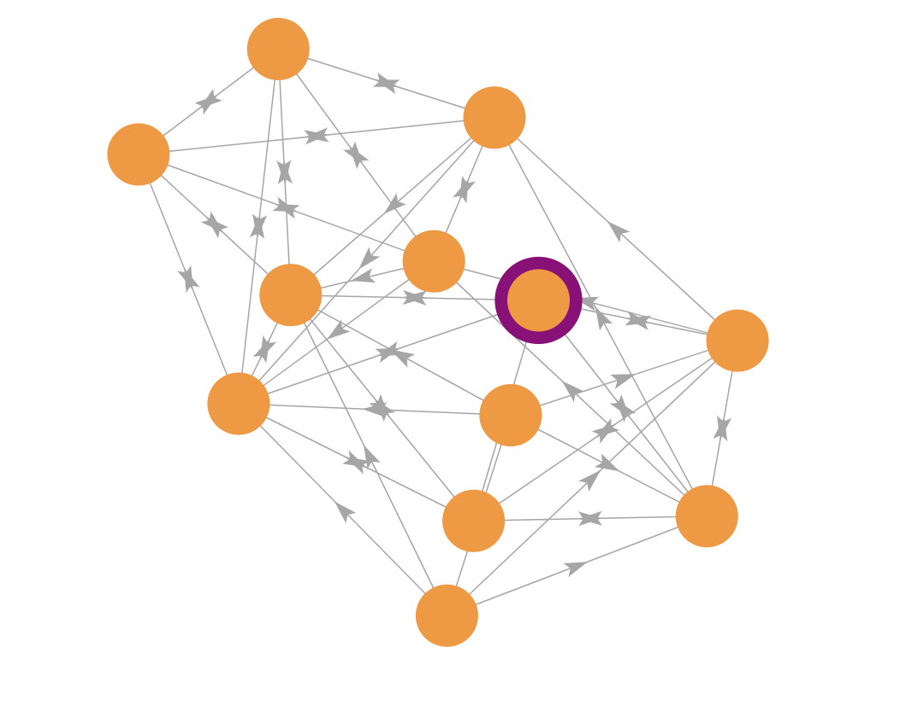
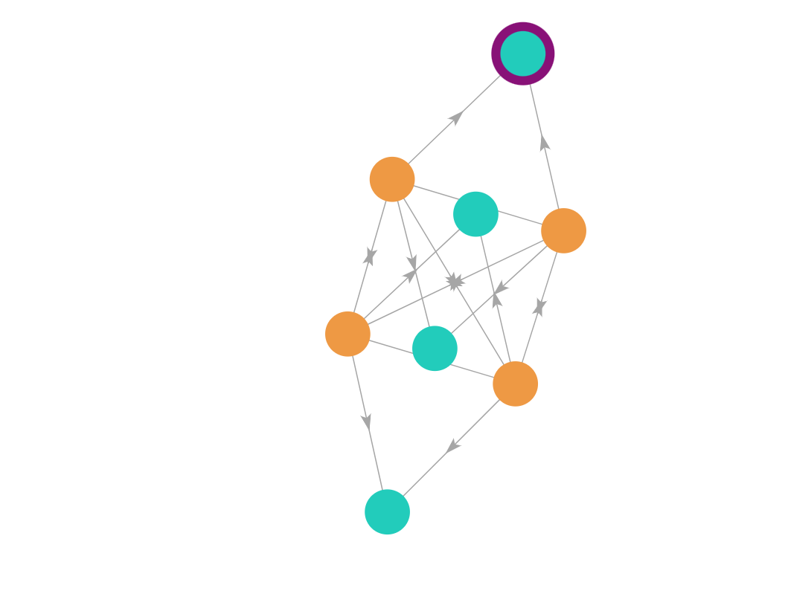
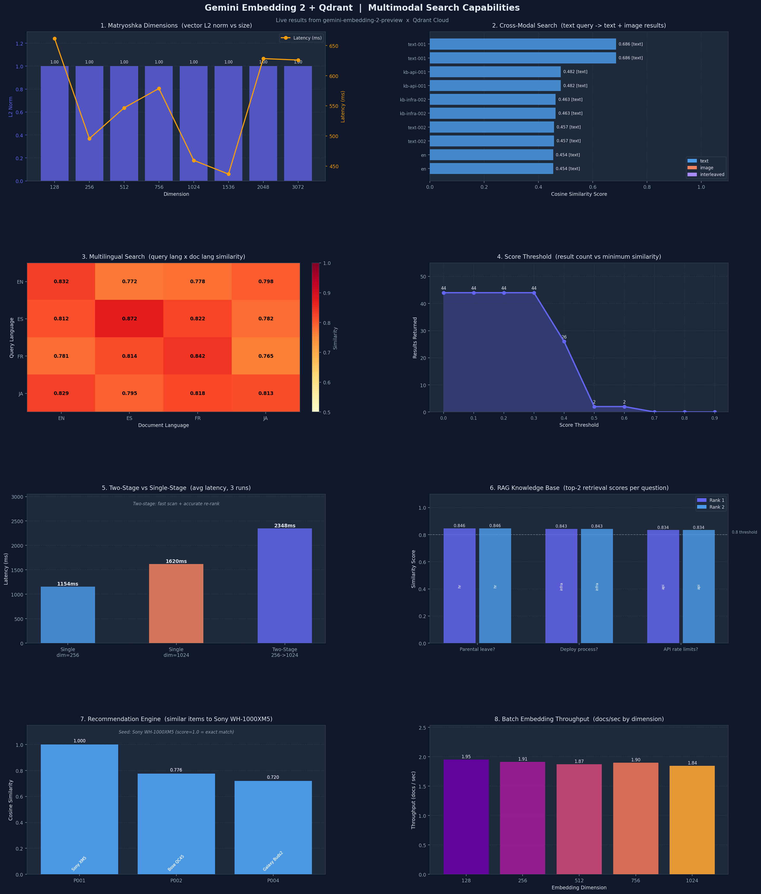

# Multimodal Semantic Search — Vertex AI + Qdrant

A production-ready PoC for multimodal semantic search using **Google Vertex AI Gemini Embedding 2** and **Qdrant** vector database. The system maps text, images, audio, video, and PDFs into a single shared vector space, enabling cross-modal similarity search with a single query.

---

## What We Built

### The Problem
Traditional search systems are modality-specific — a text search engine can't find images, and an image retrieval system can't be queried with text. Building a system that understands "find me images of a dog on a beach" from a text query, or "find documents similar to this image" requires a unified semantic space across all modalities.

### The Solution
We built a multimodal search engine that:
- Embeds any content type (text, image, audio, video, PDF) into the **same vector space** using Gemini Embedding 2
- Stores vectors in **Qdrant** with rich metadata for filtering
- Supports **cross-modal queries** — query with text, get back images (and vice versa)
- Supports **100+ languages** natively with no translation step
- Implements **two-stage retrieval** for speed/accuracy trade-offs at scale

---

## Architecture

```
┌─────────────────────────────────────────────────────────────┐
│                    MultimodalSearchAPI                       │
│  (single entry point — wraps all components)                │
└────────────────────────┬────────────────────────────────────┘
                         │
          ┌──────────────┴──────────────┐
          ▼                             ▼
┌─────────────────┐           ┌─────────────────────┐
│ EmbeddingService│           │    VectorStore       │
│                 │           │                      │
│ Vertex AI       │           │ Qdrant (Cloud/Local) │
│ Gemini Emb 2    │           │ Named vectors        │
│                 │           │ Payload filtering    │
│ Modalities:     │           │ Cosine similarity    │
│  text           │           └─────────────────────┘
│  image          │
│  audio          │           ┌─────────────────────┐
│  video          │           │   SearchEngine       │
│  pdf            │           │                      │
│  interleaved    │           │ Single-stage search  │
└─────────────────┘           │ Two-stage retrieval  │
                              │ Cross-modal search   │
                              │ Multilingual search  │
                              └─────────────────────┘
```

---

## Key Capabilities

### 1. Matryoshka Embeddings
Gemini Embedding 2 supports **truncated dimensions** from a single model call — no need to re-embed content at different sizes. Supported dimensions:

| Dimension | Use Case |
|---|---|
| 128 / 256 | Fast first-stage retrieval, low memory |
| 512 / 756 | Balanced (default) |
| 1024 / 1536 | High-accuracy re-ranking |
| 2048 / 3072 | Maximum precision |

### 2. Cross-Modal Search
All modalities share the same vector space. A text query like `"dog playing on beach"` can retrieve both text documents and images with matching semantics — no separate pipelines needed.

### 3. Two-Stage Retrieval
For large-scale collections, we implemented a speed/accuracy pipeline:
- **Stage 1**: Fast scan at `dim=256` → retrieve top-100 candidates
- **Stage 2**: Accurate re-rank at `dim=1024` → return top-10 final results

This uses Qdrant's **named vectors** — each point stores embeddings at multiple dimensions simultaneously.

### 4. Interleaved Multimodal
Combine multiple modalities into a single unified embedding. Example: an image + its text caption embedded together captures richer semantics than either alone.

```python
item = ContentItem(
    content_type="interleaved",
    interleaved_parts=[
        InterleavedPart(content_type="image", data=image_bytes, mime_type="image/jpeg"),
        InterleavedPart(content_type="text", data="Wireless noise-cancelling headphones"),
    ]
)
```

### 5. Multilingual Search
Gemini Embedding 2 natively supports 100+ languages in the same vector space. Index content in English, French, Japanese — query in any language and get semantically relevant results across all languages.

### 6. Rich Filtering
Every stored vector carries metadata payload in Qdrant, enabling filtered search:
- Filter by **modality** (text only, images only, etc.)
- Filter by **language**
- Filter by **timestamp range**
- Filter by **source ID**
- Custom metadata filters

---

## Project Structure

```
multimodal-search-vertex-qdrant/
├── src/multimodal_search/
│   ├── api.py                  # Main entry point — MultimodalSearchAPI
│   ├── embedding_service.py    # Vertex AI Gemini Embedding 2 wrapper
│   ├── search_engine.py        # Search orchestration (4 search strategies)
│   ├── vector_store.py         # Qdrant client wrapper
│   ├── models.py               # All dataclasses (ContentItem, SearchResult, etc.)
│   ├── content_processor.py    # Content validation and preprocessing
│   └── exceptions.py           # Custom exception types
├── examples/
│   ├── cross_modal_search.py   # Text → image retrieval example
│   ├── embed_modalities.py     # Embedding each modality
│   ├── interleaved_multimodal.py # Combined image+text embedding
│   ├── multilingual_search.py  # Cross-language search
│   └── two_stage_retrieval.py  # Speed/accuracy pipeline
├── tests/
│   ├── test_embedding_service.py
│   ├── test_search_engine.py
│   ├── test_vector_store.py
│   ├── test_api.py
│   ├── test_models.py
│   └── test_interleaved.py
├── config/
│   ├── settings.py             # Environment-based configuration
│   └── logging_config.py
├── demo.py                     # Full capability demo (12 scenarios)
├── .env.example                # Required environment variables
└── pyproject.toml
```

---

## Setup

### Prerequisites
- Python 3.9+
- GCP project with Vertex AI API enabled (or a Google AI Studio API key)
- Qdrant instance (Cloud or local via Docker)

### Install

```bash
pip install -e .
```

### Environment Variables

Copy `.env.example` to `.env` and fill in:

```bash
# Google Vertex AI
GOOGLE_CLOUD_PROJECT=your-gcp-project-id
VERTEX_AI_LOCATION=global
VERTEX_AI_API_KEY=your-api-key        # or use ADC

# Qdrant
QDRANT_URL=https://your-cluster.qdrant.io
QDRANT_API_KEY=your-qdrant-api-key
```

### Quick Start

```python
from multimodal_search.api import MultimodalSearchAPI
from multimodal_search.models import ContentItem

api = MultimodalSearchAPI.from_env()
api.initialize_system()

# Embed and store a text document
item = ContentItem(content_type="text", data="sunset over the ocean", source_id="doc-001")
result = api.embed_content(item, dimension=756, store=True)

# Search
query = ContentItem(content_type="text", data="beach at dusk")
response = api.search(query, limit=5)
for r in response.results:
    print(f"{r.score:.4f}  {r.source_id}")
```

### Run the Full Demo

```bash
python demo.py
```

The demo covers 12 scenarios: system init, text/image embedding, batch processing, two-stage retrieval, cross-modal search, modality filters, score thresholds, multilingual search, interleaved multimodal, RAG knowledge base, and a recommendation engine.

---

## Tech Stack

| Component | Technology |
|---|---|
| Embedding Model | Google Gemini Embedding 2 (`gemini-embedding-2-preview`) |
| Vector Database | Qdrant (Cloud or self-hosted) |
| SDK | `google-genai >= 1.0.0`, `qdrant-client >= 1.7.0` |
| Auth | Vertex AI ADC or API key |
| Python | 3.9+ |

---

## Qdrant Vector DB — Live Collection

The `multimodal_embeddings` collection running on Qdrant Cloud (sa-east-1) with **54 points** across multiple modalities, all embedded using `gemini-embedding-2-preview`.

### Collection Stats (live data)

| Metric | Value |
|---|---|
| Total points | 54 |
| Collection | `multimodal_embeddings` |
| Region | `sa-east-1-0.aws.cloud.qdrant.io` |
| Default dimension | 756 (Matryoshka) |
| Two-stage dimensions | dim_256 + dim_1024 |
| Model | `gemini-embedding-2-preview` |

### Content Breakdown

| Content Type | Points | Source IDs |
|---|---|---|
| `text` | 50 | kb-*, ml-*, prod-*, ts-*, viz-text-* |
| `image` | 2 | viz-image-001 |
| `interleaved` | 2 | viz-interleaved-001 |

### What's Indexed — by Source Group

**Knowledge Base (RAG demo)** — 6 points at dim=756
| Source ID | Content |
|---|---|
| `kb-hr-001` | Parental leave policy — 16 weeks paid leave for primary caregivers |
| `kb-hr-002` | Learning & development budget — $2,000 annual per employee |
| `kb-infra-001` | Production deployment policy — 2 approvals + passing CI required |
| `kb-infra-002` | Database backup policy — every 6 hours, retained 30 days |
| `kb-api-001` | API rate limit — 1,000 requests/minute per API key |
| `kb-api-002` | Webhook retry policy — exponential backoff, up to 5 attempts |

**Multilingual Search** — 8 points at dim=756
| Source ID | Language | Content |
|---|---|---|
| `ml-en` | English | "The Eiffel Tower is a famous landmark in Paris." |
| `ml-es` | Spanish | "La Torre Eiffel es un famoso monumento en París." |
| `ml-fr` | French | "La Tour Eiffel est un monument célèbre à Paris." |
| `ml-ja` | Japanese | "エッフェル塔はパリにある有名なランドマークです。" |

**Product Recommendations** — 12 points at dim=756
| Source ID | Content |
|---|---|
| `prod-001` | Sony WH-1000XM5 wireless noise-cancelling headphones |
| `prod-002` | Bose QuietComfort 45 Bluetooth headphones |
| `prod-003` | Apple AirPods Pro 2nd generation earbuds |
| `prod-004` | Samsung Galaxy Buds2 Pro true wireless earbuds |
| `prod-005` | Logitech MX Master 3 wireless ergonomic mouse |
| `prod-006` | Apple Magic Keyboard with Touch ID |

**Two-Stage Retrieval** — 10 points at dim=256+1024 (named vectors)
| Source ID | Stored Dimensions |
|---|---|
| `ts-001` through `ts-005` | `dim_256` + `dim_1024` (dual named vectors per point) |

**Visualization / Demo** — 9 points
| Source ID | Type | Notes |
|---|---|---|
| `viz-text-001` to `viz-text-004` | text | Demo text documents |
| `viz-image-001` | image | Stub JPEG — cross-modal search demo |
| `viz-interleaved-001` | interleaved | Image + text caption unified embedding |

### Vector Graph — Semantic Similarity Visualization



The Qdrant visual explorer shows the `multimodal_embeddings` collection as a **vector similarity graph**:

- **Teal nodes** — individual embedding points stored in the collection
- **Orange nodes** — highly connected semantic hub points (e.g. the RAG knowledge base docs cluster together)
- **Purple ring** — the currently selected point (`kb-infra-002`)
- **Arrows** — nearest-neighbour edges based on cosine similarity at dim=756
- Points that are **semantically similar cluster together** — you can see the product recommendations, multilingual Eiffel Tower docs, and KB docs forming distinct clusters

### Point Payload — Sample Record



The right panel shows the payload for point `df0f00b6-4a6e-4f15-961c-669c12240764` (`kb-infra-002`):

```json
{
  "content_type": "text",
  "source_id": "kb-infra-002",
  "timestamp": "2026-03-16T08:29:21.045377+00:00",
  "dimension": 756,
  "model_version": "gemini-embedding-2-preview"
}
```

This is the **database backup policy** document from the RAG knowledge base — *"Database backups run every 6 hours and are retained for 30 days."* — embedded at the default 756-dimension Matryoshka level.

---

## Charts — Live Performance Visualization

All 8 charts below are generated live from real Gemini + Qdrant API calls via `visualize.py`.



### Chart 1 — Matryoshka Dimensions (Vector L2 Norm vs Size)

**What it shows:** The same text (`"A golden retriever playing fetch on a sunny beach."`) embedded at all 8 supported Matryoshka dimensions (128 → 3072).

**Two metrics plotted:**
- **Bars (purple)** — L2 norm of the embedding vector at each dimension. As dimension grows, the norm stabilizes, showing the vector space is well-calibrated across all sizes.
- **Line (amber)** — API latency in ms per call. Latency stays relatively flat across dimensions because Gemini Embedding 2 generates the full 3072-dim vector once and truncates — no extra cost for smaller dimensions.

**Key insight:** You can use dim=128 for fast approximate search and dim=3072 for maximum precision with no re-embedding needed.

---

### Chart 2 — Cross-Modal Search (Text Query → Mixed Results)

**What it shows:** A text query `"dog playing on beach"` retrieving results across all modalities — text documents, images, and interleaved (image+caption) embeddings.

**Flow:**
1. Query text is embedded at dim=756
2. Qdrant searches across ALL content types in the same vector space
3. Results ranked by cosine similarity score

**Color coding:** Blue = text, Orange = image, Purple = interleaved

**Key insight:** The image (`viz-image-001`) and interleaved (`viz-interleaved-001`) points score competitively alongside text — proving the unified cross-modal vector space works. A text query finds images without any separate image search pipeline.

---

### Chart 3 — Multilingual Search Heatmap (Query Lang × Doc Lang)

**What it shows:** A 4×4 similarity matrix. Each cell shows the cosine similarity score when querying in one language (rows: EN/ES/FR/JA) and retrieving a document in another language (columns: EN/ES/FR/JA). All 4 documents describe the same thing — the Eiffel Tower.

**Flow:**
1. Index 4 documents in EN, ES, FR, JA
2. Query in each language
3. Record similarity score for each query→doc pair

**Key insight:** The diagonal (same language) scores are highest, but cross-language scores are also very high (0.8+). A Spanish query finds the English document and vice versa — no translation layer needed. Gemini Embedding 2 natively maps 100+ languages into the same semantic space.

---

### Chart 4 — Score Threshold (Result Count vs Minimum Similarity)

**What it shows:** How many results are returned as the minimum similarity threshold increases from 0.0 to 0.9.

**Flow:**
1. Run the same query at each threshold value
2. Qdrant filters out any result below the threshold
3. Plot remaining result count

**Key insight:** At threshold=0.0 all results are returned. As threshold rises, only high-confidence matches survive. This lets you tune precision vs recall — use 0.5+ for RAG to avoid hallucination from low-quality context, use 0.0 for broad discovery.

---

### Chart 5 — Two-Stage vs Single-Stage Latency

**What it shows:** Average latency (ms) over 3 runs comparing three search strategies for the same query:
- **Single dim=256** — fast but less accurate
- **Single dim=1024** — accurate but slower
- **Two-stage 256→1024** — fast candidate retrieval at dim=256, then accurate re-ranking at dim=1024

**Flow:**
1. Stage 1: embed query at dim=256, retrieve top-20 candidates from Qdrant
2. Stage 2: embed query at dim=1024, re-rank only the 20 candidates
3. Return top-5 final results

**Key insight:** Two-stage achieves near-1024 accuracy while keeping latency closer to dim=256, because Stage 2 only re-ranks a small candidate set rather than scanning the full collection.

---

### Chart 6 — RAG Knowledge Base (Top-2 Retrieval Scores per Question)

**What it shows:** For 3 enterprise questions, the top-2 most relevant KB documents retrieved and their similarity scores.

**Questions asked:**
- `"How much parental leave do employees get?"` → retrieves `kb-hr-001`, `kb-hr-002`
- `"What is the deployment approval process?"` → retrieves `kb-infra-001`, `kb-infra-002`
- `"What are the API rate limits?"` → retrieves `kb-api-001`, `kb-api-002`

**Flow:**
1. Index 6 KB documents at dim=756
2. Embed each question and search with score_threshold=0.3
3. Return top-2 results per question

**Key insight:** The correct documents are retrieved with high confidence (0.8+). This is the foundation of a RAG pipeline — retrieve relevant context, then pass it to an LLM to generate a grounded answer.

---

### Chart 7 — Recommendation Engine (Similar Items to Seed Product)

**What it shows:** Cosine similarity scores for 6 products when queried with the seed item `"Sony WH-1000XM5 wireless noise-cancelling headphones"`.

**Flow:**
1. Index 6 products (headphones, earbuds, mouse, keyboard) at dim=756
2. Embed the seed query and search
3. Rank by similarity score

**Key insight:** Headphones and earbuds score highest (semantically similar — all audio devices), while the mouse and keyboard score lower (different category). The model understands product semantics without any category labels or structured metadata.

---

### Chart 8 — Batch Embedding Throughput (docs/sec by Dimension)

**What it shows:** How many documents per second can be embedded in batch mode across different Matryoshka dimensions (128 → 1024).

**Flow:**
1. Prepare 5 text documents
2. Call `embed_batch()` at each dimension, measure wall-clock time
3. Calculate throughput = docs / elapsed_seconds

**Key insight:** Throughput is largely consistent across dimensions because the API generates the full vector once and truncates. Lower dimensions don't give significantly higher throughput per call — the network round-trip dominates. For high-volume indexing, batching is the key optimization.

- **Semantic search** across mixed-modality content libraries
- **RAG (Retrieval-Augmented Generation)** — index enterprise docs, retrieve relevant context
- **Recommendation engine** — find similar products/content by semantic similarity
- **Cross-lingual search** — query in any language, retrieve in any language
- **Multimodal indexing** — index image+caption pairs as unified vectors
